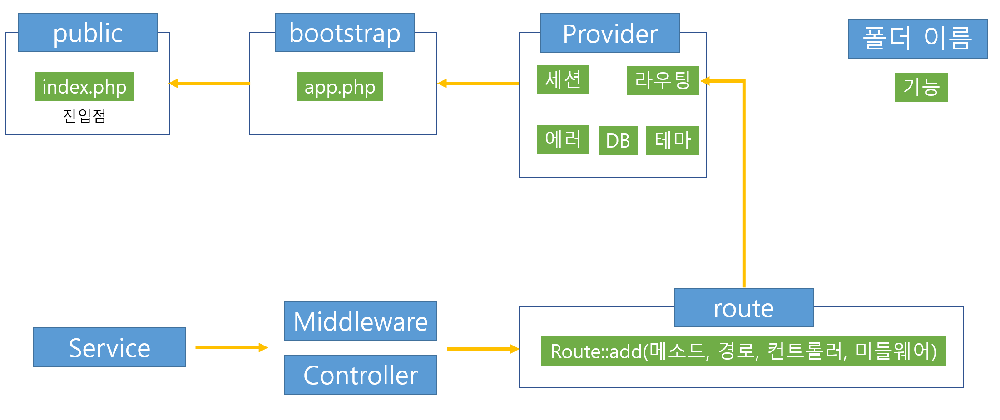

# blog

PHP로 작성한 [미니 프레임워크](https://github.com/HaejinYang/iced-americano)를 기반으로 블로그 만든다.

# 목적

블로그는 게시글을 보여줄 수 있으며, 작성자는 수정 및 삭제를 할 수 있다.

# 목표

1. 이전에 제작한 미니 프레임워크를 기반으로 한다.
1. 게시물을 관리한다. 읽기, 쓰기, 수정, 삭제가 가능해야 한다.
1. 유저를 관리한다. 회원가입, 로그인, 로그아웃이 가능하다.
1. 게시물의 쓰기, 수정, 삭제는 권한이 있는 유저만 가능하다.

# 구조

## 실행 흐름


서버가 클라이언트의 요청을 받는 시작점은 `public/index.php`이다. 이후 `bootstrap/app.php`를 거쳐 서비스 프로바이더를 실행하여 클라이언트의 요청에 응답한다.
서비스 프로바이더는 서버의 기능을 모듈화한 것으로, 어떤 서비스 프로바이더를 제공하냐에 따라 서버의 동작이 달라지게 된다. 라우팅, 세션, 타임존, 에러 핸들링 등의 기능들이 서비스 프로바이더에 정의된다.
최종적으로 클라이언트 요청은 라우팅 서비스 프로바이더에 의하여 정의된 라우팅 로직에 의하여 미들웨어와 컨트롤러를 거쳐 처리된다.

## 디렉토리 구조

```
blog
│
├─app
│  │
│  ├─Controller
│  │
│  ├─Helper
│  │
│  ├─Middleware
│  │
│  ├─Provider
│  │
│  └─Service
│
├─bootstrap
│      app.php
│
├─docker
│
├─public
│
├─resource
│  └─view
│
├─route
│      app.php
│      web.php
│
├─storage
│
└─vendor
```

## 세부사항

### 엔트리 포인트

`public/index.php`가 엔트리 포인트이다.

### 서버 어플리케이션

`bootstrap/app.php`에서 서버를 정의한다. `ServiceProvider`를 상속받은 클래스를 이용하여 서버가 어떤 동작을 할지 결정한다.
서버는 어떤 `ServiceProvider`를 실행하느냐에 따라 기능이 달라진다.

### 서버 로직

`app/`디렉토리 안에는 서버의 로직을 모아둔다. 라우트에 등록할 컨트롤러와 미들웨어를 정의한다. 그리고, 유저와 게시물 관리를 위한 클래스와 서비스가 있다.
마지막으로 이 모든 것들을 담아서 기능으로 서버 어플리케이션에 제공할 서비스 프로바이더가 있다.

### 컨트롤러

`app/Controller`는 컨트롤러를 모아둔 디렉토리다. 라우팅 과정에서 일치하는 컨트롤러가 호출된다. 컨트롤러는 요청을 받아 특정 서비스들을 호출하여 그 결과를 유저에게 응답한다.
웹 페이지 혹은 json 데이터를 응답한다. 웹 페이지를 응답할 때는 `Theme`클래스를 사용한다. `Theme`클래스는 등록한 레이아웃을 유저에게 보여주는 역할이다. 보여줄 페이지와 데이터를 넘겨 호출한다.

### 미들웨어

`app/Middleware`는 미들웨어를 모다운 디렉토리다. 메인 로직을 담당하는 컨트롤러 이전에 전처리를 진행한다. 전처리엔 로그인된 유저인지, 토큰은 있는지 등을 확인한다. 미들웨어는 여러 컨트롤러에서
공통으로 쓰인다.

### 서비스프로바이더

`app/Provider`는 서비스 프로바이더를 모아둔 디렉토리다. 서비스 프로바이더는 서버가 실행하는 단위이며, 서버가 인식하는 최상위 레이어이다.
서버를 정의하는 Application을 보면 서비스 프로바이더를 받아 실행하는 기능 뿐이 없다. 에러 핸들링, 라우팅, 데이터베이스 관리, 세션 관리 등은 모두 서비스 프로바이더에 정의된다.

### 서비스

`app/Service`는 컨트롤러에서 호출하는 일련의 로직을 담은 디렉토리다. 인증에 대한 것, 게시굴의 CRUD, 유저, 이미지 관리를 위한 로직을 실행한다.
컨트롤러에선 최소한의 확인만을 하며, 실제 로직은 서비스가 담당한다.

### 라우트

`route/`디렉토리는 라우팅을 정의한다. HTTP 메소드, 경로, 미들웨어, 핸들러를 정의한다. 여기서 정의된 Route는 RouteProvide에 담겨 서버에 제공된다.

### 저장소

`storage/`디렉토리는 로그와 서버에 게시글과 함께 업로드된 이미지를 관리한다.

### 도커

`docker/`디렉토리는 도커 파일을 관리한다. MySQL 이미지를 이용하여 데이터베이스를 실행한다.

# 참고

[PHP 7+ 프로그래밍: 객체지향](https://www.inflearn.com/course/php7-oop/dashboard)강의를 수강하며 진행하였음.
